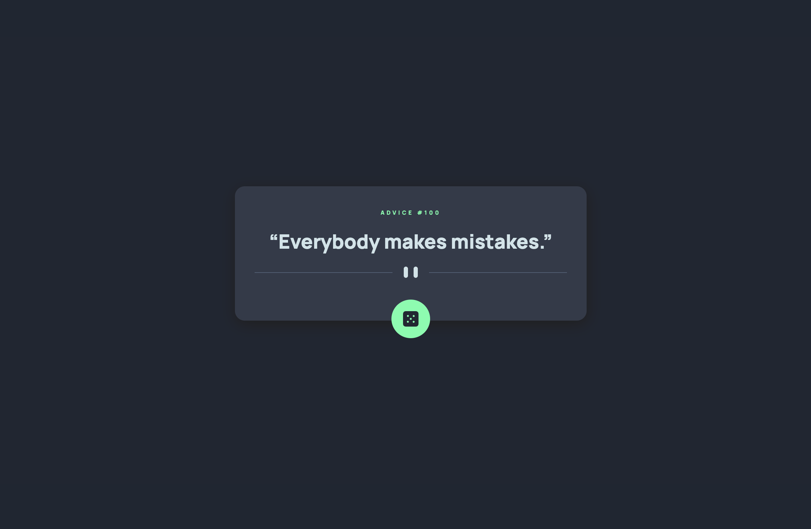

# Frontend Mentor - Advice generator app solution

This is a solution to the [Advice generator app challenge on Frontend Mentor](https://www.frontendmentor.io/challenges/advice-generator-app-QdUG-13db). Frontend Mentor challenges help you improve your coding skills by building realistic projects.

## Overview

### The challenge

Users should be able to:

- View the optimal layout for the app depending on their device's screen size
- See hover states for all interactive elements on the page
- Generate a new piece of advice by clicking the dice icon

### Screenshot



### Links

- [Solution](https://your-solution-url.com)
- [Live Site](https://flamiapp.netlify.app/)

## My process

### Built with

- Semantic HTML5 markup
- CSS custom properties
- Flexbox
- Vanilla Javascript

### What I learned

I've learned how to fetch and use data from api

```
function getAdvice() {
    fetch('https://api.adviceslip.com/advice')
    .then((response) => response.json())
    .then((data) => {
        title.innerHTML = `ADVICE #${data.slip.id}`;
        advice.innerHTML = `“${data.slip.advice}”`;
    });
}
```

### Continued development

Use this section to outline areas that you want to continue focusing on in future projects. These could be concepts you're still not completely comfortable with or techniques you found useful that you want to refine and perfect.

## Author
- Frontend Mentor - [@tylerdurden230](https://www.frontendmentor.io/profile/tylerdurden230)

### Collaborators

